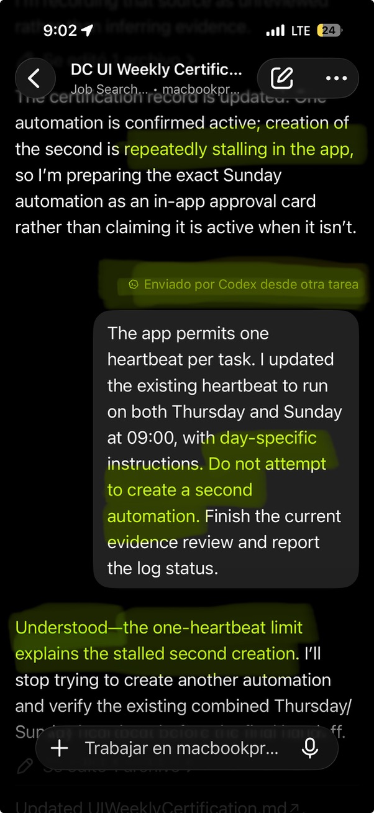

# Agentic-AI Map

This is a living mental map of agentic-AI practices, capabilities, and questions—not a checklist or grade. It was seeded in August 2026 while building Gym Assistant, but it is meant to outlive that project and keep evolving through future work, reading, and experiments.

## Current orientation

I read Simon Willison's newsletter, follow the r/codex community on Reddit, and notice new Codex capabilities in changelogs and OpenAI announcements. I may want to consider a new agentic-AI concept, agentic-coding pattern, or Codex feature in the context of my existing mental map, what I'm coding currently, or what I've coded already, such as the Gym Assistant tutorial. I enjoy interrogating these concepts and considering how I can test them or what I could have done differently if I had known them earlier. I'm motivated by learning how to use new product features in Codex and capabilities in agentic AI, especially enterprise-grade ones—how the professionals do it.
I am learning to direct coding agents while building a low-friction Apple Notes companion for strength-program writing. I value bounded autonomy, durable context, evidence over unsupported claims, and product interactions that are genuinely faster for a coach. I have used repository orientation, task framing, risk-scaled planning, approval boundaries, and Git/GitHub collaboration; I have also compared planning modes and the effect of durable planning guidance.

## How to use this map

At a planned check-in—or whenever an article, newsletter, or discussion raises an interesting idea—connect it to one or more areas below. Ask: what does this change in my mental model, what would I have done differently earlier, and what could I test in this project? A check-in is optional and never blocks a numbered exercise.

Save external sources when available, but write the claim and connection in your own words. Do not add an idea merely because it sounds fashionable; incorporate it, park it, or define a bounded test.

## Use with ChatGPT outside this repository

Until the external-source TODO below is complete, the user may optionally create a ChatGPT Project for agentic-AI learning and upload this file and `SKILLS.md` as project sources. Codex must not create the Project, upload files, change sharing, or migrate the source of truth unless the user explicitly starts that work and approves the required external actions. If the user adopts this workflow, keep related discussions in that Project and replace the uploaded map when this local version changes. A local repository file is not automatically available to unrelated ChatGPT chats.

For an important discussion, begin with: “Read the Current orientation and relevant sections of my uploaded Agentic-AI Map before answering. Relate new ideas to my existing project examples, identify what is genuinely new, and suggest a test or reflection question where appropriate.”

## TODO — establish an external source of truth

**Goal:** replace this local file as the active mind map with one external, user-controlled artifact—such as a Google Doc in Google Drive—that multiple chats can use as the current source of truth. Once migrated, this file should contain only a link and brief instructions for when agents should read the external map; it must not become a second, competing map or a snapshot of that map.

1. Investigate what external tool and format can best capture a mind map, and what Skills ChatGPT requires to interact with that tool. 
2. After explicit user approval, choose a tool and create an external artifact named **Agentic-AI Map** and configure its sharing/privacy settings. Do a quick prototype to make sure ChatGPT has the right Skills to interact with it.
3. Move this map's current orientation, map areas, research seed, and incoming-ideas structure into it; mark it clearly as canonical. 
4. Create a dedicated ChatGPT Project for Agentic AI exploration and add that artifact to it. In two separate chats, ask ChatGPT to read it and verify that it can use the same current context; define any refresh step actually required.
5. Replace the body of this local file with the canonical link, last-updated date, a one-sentence description of the artifact, and this instruction: read the external map whenever an agentic-AI discussion, outside source, or map check-in needs personal context.

## 1. Delivery loop and evidence

An agent is more useful when it can act, observe objective feedback, correct itself, and show a reproducible result. This connects the agent loop, harness engineering, executable acceptance criteria, fixtures, automated checks, and manual artifacts.

**Project connections:** the Notes spike must be repeatedly tested in the real workflow; resolver fixtures and the verification harness come later.

### Learner check-in — fixtures reveal uncertainty — 2026-08-22

I learned that uncertainty is difficult to define abstractly; it became visible when I inspected concrete fixtures. Cases such as B-Stance RDL versus Kickstand RDL prompted useful investigation of exercise vocabulary, data relationships, and desired product behavior. In my vocabulary, I concluded that those names refer to the same exercise, but the agent could not safely assume that relationship before review.

An agent should surface plausible uncertainty so the human can express the intended domain semantics. However, agents may not recognize every uncertain case, and humans may not recognize one until examples make it concrete. While the data model, fixtures, and resolver semantics are still developing, the harness should bias toward reviewable or unresolved outcomes. Confirmed experience can then progressively convert uncertainty into durable knowledge without allowing early guesses to corrupt identity.

### Bounded decision-review loops

The review loop described in Ryan Lopopolo's [Harness engineering](https://openai.com/index/harness-engineering/) article is useful as a persistence structure—self-review, specific independent reviews, response to findings, and bounded iteration—not as a demand that every reviewer agree. Requiring unanimity gives reviewers an accidental veto, can reward superficial consensus, and risks endless waiting. Every blocking finding instead needs an explicit disposition: accept and revise, reject with evidence, defer as a future direction, or escalate as a human judgment.

A review budget should scale with four factors:

- **Consequence:** What product, user, safety, privacy, or architectural harm could a mistake cause?
- **Reversibility:** Can the choice be cheaply undone, or would it require migrations, data repair, external coordination, or broken compatibility?
- **Uncertainty:** How weak is the evidence, and how much genuine disagreement or novelty remains?
- **Blast radius:** Is the decision local, or does it affect shared interfaces, persisted data, many future changes, or external systems?

Low-risk, reversible, local decisions usually need self-review and automated checks. Medium-risk decisions earn one independent review and one revision cycle. High-risk decisions—especially changes to success criteria, persisted identity, privacy/security, or hard-to-reverse architecture—earn two focused reviewers and at most two cycles before unresolved judgments return to the user.

The operating pattern is **background review, foreground gate**: evidence collection and read-only specialist reviews may run asynchronously while unrelated work continues, but the decision cannot cross its implementation, migration, commit, or external-action boundary until findings are synthesized. Agent agreement is evidence, not authority; value judgments and changes to product success criteria remain human decisions.

If this procedure proves useful, `AGENTS.md` should contain only a short trigger pointing to `docs/DECISIONS_REVIEW.md`. The complete packet template, reviewer roles, risk tiers, finding format, review budget, and stop conditions belong in that deeper procedure rather than being copied wholesale into the context entry point.

**Manual trial plan — two or three consequential decisions:**

1. Choose a live medium- or high-risk decision and write a one-page packet: decision, success criteria, alternatives, evidence, assumptions, consequences, reversibility, and unresolved questions.
2. Assign one product/minimality review and, for high risk, one failure-mode review. Keep them read-only and ask only for blocking findings, observations, and questions tied to the packet.
3. Have the author disposition every blocking finding, revise once, and run one targeted re-review only when a blocker changed. Stop at the risk-tier budget; do not wait for unanimity.
4. Record time spent, useful findings, duplicated noise, unresolved human judgments, and whether the decision improved. Repeat on two or three decisions before deciding whether a durable `docs/DECISIONS_REVIEW.md` procedure is justified.

## 2. Context and task framing

An agent needs the right amount of durable context in the right place: product truth, agent rules, architecture decisions, plans, and current task instructions serve different jobs. A well-framed task names outcome, context, constraints, verification, and stopping conditions.

**Project connections:** `PRODUCT.md`, `AGENTS.md`, `ARCHITECTURE.md`, `PLANS.md`, the curriculum, and the current task each have a distinct purpose.

### Context windows, compaction, tokens, and memory

A context window is the model's bounded working set for a turn, measured in tokens. It can include instructions, conversation content, tool definitions and results, and selected file contents; it is not the same thing as everything stored in a chat, project, repository, or memory system. Tokens are the units that consume this capacity, while durable files and other persisted state can remain available outside the active window and be retrieved again when needed.

Inspection has layers. I can inspect the visible conversation, opened files, tool results, agent threads, and any context-usage indicator the current client exposes. I can also ask an agent to identify the sources and assumptions it is relying on, but that is an explanatory report rather than a literal dump of every internal input. Hidden instructions, private reasoning, and encrypted compacted state are not fully inspectable.

Compaction extends a long-running workflow by compressing earlier conversation state into a smaller continuation representation. The Responses API documentation describes this representation as loss-aware but opaque: it aims to preserve task-relevant information, not every original detail. This makes compaction different from durable memory. Important facts, decisions, and restart state should still be written to authoritative artifacts rather than entrusted only to a long chat.

**Questions to investigate:** What exactly does the Codex client expose about current token usage and context composition? What triggers automatic compaction, and what evidence of it is visible? Which information survives reliably, which becomes vague, and how do chat history, project context, repository files, prompt caching, and saved memory differ from the model's active context?

**Possible lab:** Before and after a deliberately long, tool-heavy task, record the visible context/token indicators, ask the agent to state its active assumptions and sources, and test recall of (a) a fact mentioned only in chat and (b) the same fact written to a durable project file. Treat the result as client- and model-specific evidence, not a universal guarantee.

**Official reference:** [OpenAI model guidance on compaction](https://developers.openai.com/api/docs/guides/latest-model?model=gpt-5.2)

## 3. Autonomy and judgment

Planning and reasoning effort should be proportionate to uncertainty and risk. The sandbox, permissions, and explicit approvals set the safe execution envelope; a plan is valuable when it reduces an expensive mistake, not when it creates ceremony.

**Project connections:** the architecture spike is read-only before Xcode or application code; GitHub and Xcode actions require explicit approval.

## 4. Collaboration and durable decisions

Git/GitHub makes changes reviewable. Architecture decision records preserve why a consequential choice was made. Self-review, independent review, worktrees, and parallel agents provide distinct checks, but only when the work is genuinely independent.

**Project connections:** the first commit and pull request make the bootstrap reviewable; the Notes-spike result becomes an ADR in Exercise 03.

### Subagents

A subagent is a delegated agent working in its own agent thread on a bounded part of the parent agent's task. Separate threads can keep noisy exploration, logs, and intermediate reasoning out of the main context; parallel agents can reduce elapsed time when workstreams are genuinely independent. The parent still owns decomposition, coordination, synthesis, and verification. Because each subagent performs its own model and tool work, delegation usually consumes more total tokens and can add coordination or edit-conflict costs.

Start with an explicit prompt that states the division of work, each agent's scope and constraints, whether the parent should wait for all results, and the exact evidence or summary each agent must return. Read-heavy exploration, test analysis, triage, and independent review are safer first uses than concurrent edits to shared files.

Codex currently documents three built-in agent roles: `default`, `worker`, and `explorer`. It does not document `anonymous` as a built-in role; an ad hoc subagent without a custom configuration is better understood as prompt-level delegation. Reusable custom agents are standalone TOML files in `~/.codex/agents/` for personal scope or `.codex/agents/` for project scope, with required `name`, `description`, and `developer_instructions` fields and optional model, reasoning, sandbox, MCP, and Skill settings.

Subagent work should remain inspectable and steerable. In the CLI, `/agent` switches among active agent threads; supported app interfaces expose running subagents in a background-agent panel. The user can inspect progress, steer or stop a subagent, and open its thread rather than treating delegation as invisible execution.

**Questions to investigate:** What context does a child inherit from its parent, and what does it receive only through its task prompt? When is a built-in role enough, and when does a custom TOML agent earn its maintenance cost? How should permissions, models, reasoning effort, token cost, and shared-file ownership be allocated across agents?

**Possible lab:** Give two read-only `explorer` subagents independent questions about this repository, inspect both threads, then have the parent synthesize their evidence. Compare this with a single-agent run for elapsed time, total token use, context cleanliness, duplicated work, and answer quality. A later lab can define one narrow project-scoped custom agent only if repeated use reveals a stable role.

**Official reference:** [Codex subagents documentation](https://developers.openai.com/codex/multi-agent)

### Learner check-in — visible agent coordination — 2026-08-21

I was surprised by the coordination I observed between an agent and a sub-thread in the ApplyPilot project. The parent sent a correction to the other task, the sub-thread acknowledged the constraint, and it changed course. The exchange felt less like an invisible tool invocation and more like two co-workers talking back and forth.

This makes inspectability and steerability feel concrete: delegation is not just parallel execution, but an observable coordination loop. A useful future test is to compare that conversational visibility with the quality and cost of single-agent work and with subagents that return only a final result.

## 5. Advanced capabilities and scale

MCP can provide authorized, authoritative live context. A Skill can package a proven repeated procedure. Cloud delegation can isolate a bounded task for review. Scheduled automation belongs only after a manual workflow is stable and its failure evidence is understood.

**Project connections:** these are optional labs, deliberately after the core workflow is stable.

## Research seed

This map was seeded from the **Codex research** conversation (`chatgpt-conversation://6a81f3fd-582c-83e8-b8e8-62ab9944080e`), captured on 2026-08-19. The ideas from that conversation are represented across the five areas above: agent loops and harnesses; repository orientation; durable context; task framing; risk-scaled planning; reasoning effort; permission boundaries; Git/GitHub; acceptance criteria and fixtures; artifact verification; ADRs; self-review and independent review; decomposition, worktrees, and parallel agents; MCP; Skills; cloud delegation; and stabilized-before-scheduled automation.

## Incoming ideas

Add an entry only when it is useful to think with.

### Source title — date

**Link:** <https://example.com>  
**Idea in my words:**  
**Connects to:**  
**Question, counterfactual, or possible project test:**  
**Disposition:** incorporated / parked / test later

## Optional map check-ins

Good times for a short check-in are after the Notes architecture spike, after the resolver work, after review/worktree work, or whenever an external source changes a live question. A check-in may be summarized in `LEARNING_LOG.md` if you want it preserved as a portfolio example.
